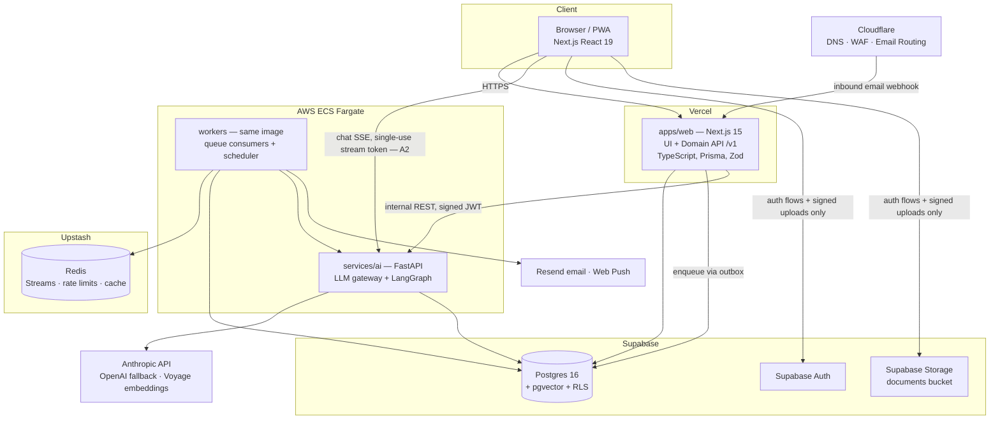

# 01 — System Architecture

## 1. Shape of the system

Two deployables plus workers, on managed platforms, with hard module boundaries inside each. This is deliberately **not** microservices (ADR-001): at seed/Series-A headcount, a service mesh is an org chart we don't have. "Microservice-ready" is achieved with contracts, an event bus, and enforced module boundaries — the seams exist; we cut along them only when a scaling trigger fires (doc 14).



## 2. Deployables and their responsibilities

| Deployable | Runtime | Hosting | Owns |
|---|---|---|---|
| `apps/web` | Next.js 15, React 19, TS 5, Node 22 | Vercel | UI (App Router + shadcn/ui + Tailwind 4), the **domain API** `/v1` (route handlers), Prisma access to Postgres, webhook receivers, outbox writes |
| `services/ai` | Python 3.12, FastAPI, LangGraph | AWS ECS Fargate (2× tasks, ALB, private subnets) | LLM gateway, all LangGraph workflows, chat streaming, embeddings |
| `services/ai` **worker mode** | same image, `python -m worker` | AWS ECS Fargate (autoscaled 1–N) | Redis Streams consumers (document pipeline, notifications dispatch, radar), cron scheduler task |

**Why the domain API lives in Next.js and not FastAPI:** the domain is CRUD + policy over Postgres; keeping it in TypeScript gives one type system from DB (Prisma) → validation (Zod) → API contract (OpenAPI) → UI, which is the single biggest DX/correctness win available to a small team. Python owns exactly what Python is best at here: the AI runtime. The AI service is **internal-only** (private subnet, service JWT, no public route except the ALB used by Vercel egress with mTLS-equivalent JWT check — doc 06 §6).

## 3. Internal module boundaries (the "modular" in modular monolith)

`apps/web/src/modules/` — each module exposes `index.ts` as its only public surface; cross-module imports of internals fail CI (eslint `import/no-internal-modules` + dependency-cruiser).

```
modules/
  identity/        # user profile, session helpers
  household/       # households, members, roles
  documents/       # upload lifecycle, review queue
  registry/        # items, vendors
  obligations/     # obligations, reminders, recurrence
  automation/      # task runs, approvals
  conversations/   # chat threads (proxying AI service)
  notifications/   # preferences, in-app feed
  billing/         # Stripe subscription state (feature-flagged post-launch)
  platform/        # outbox, audit, feature flags, rate limiting
```

`services/ai/src/` mirrors the same discipline: `gateway/` (LLM providers), `workflows/` (one package per LangGraph graph), `pipeline/` (document stages), `worker/` (consumers), `api/` (FastAPI routers). No workflow imports another workflow's internals; shared logic lives in `core/`.

## 4. Data flow rules (the constitution)

1. **The browser never talks to Postgres.** No supabase-js data queries client-side. The client uses Supabase Auth (session) and Storage (short-lived signed upload/download URLs obtained from our API). Everything else goes through `/v1`. RLS remains enabled as a second wall, not as the primary authz mechanism (doc 06 §5).
2. **All writes that must trigger side effects go through the outbox** in the same transaction (doc 07 §2). No dual-writes to Redis from request handlers.
3. **Only the AI service calls model providers.** `apps/web` has no Anthropic/OpenAI dependency (ADR-006).
4. **Documents' raw content never enters `apps/web` memory** beyond upload proxying; parsing/extraction is exclusively the pipeline's job, in the sandboxed worker (doc 05).
5. **Every state mutation writes `audit_log`** (doc 02 §9) — not left to individual handler authors. *(Correction, ADR-009 D6: a Prisma `query` extension cannot write the row itself — it holds no handle on the enclosing transaction. The extension observes mutations and refuses those lacking actor context or a required domain verb; the scoped client flushes the rows before commit. Both are infrastructure; the guarantee is unchanged.)*

## 5. Vendor set and the "one throat to choke" test

Each vendor earns its place by removing an ops burden a 6-person team should not carry. Anything not on this list requires an ADR to add.

| Concern | Vendor | Escape hatch |
|---|---|---|
| Web hosting/CDN/previews | Vercel | Next.js is portable to Node on ECS |
| Postgres, Auth, Storage | Supabase | Vanilla Postgres + GoTrue-compatible JWTs; pg_dump restores anywhere |
| Redis | Upstash | Protocol-standard Redis; ElastiCache later |
| AI compute | AWS ECS Fargate | Plain containers; the least locked-in choice possible |
| DNS/WAF/inbound email | Cloudflare | Standard DNS; Email Routing → any inbound provider |
| LLMs | Anthropic (primary), OpenAI (fallback), Voyage (embeddings) | Gateway abstraction, ADR-006 |
| Outbound email | Resend (react-email templates) | SMTP-compatible; SES as scale path |
| Errors / traces / logs / metrics | Sentry + Grafana Cloud (OTel) | OTel is vendor-neutral by construction |
| LLM observability & evals | Langfuse (cloud) | Self-hostable, OSS — chosen partly for that |
| Product analytics & flags | PostHog | Self-hostable, OSS |
| Payments (post-launch) | Stripe Billing | — |
| Secrets source of truth | Doppler → syncs to Vercel/AWS | Plain env vars everywhere |

## 6. Monorepo and tooling

- **pnpm workspaces + Turborepo** (remote cache on Vercel). Python service lives in the same repo (`services/ai`, managed by `uv`); Turbo orchestrates its lint/test via `package.json` shims so `turbo run test` is the single entry point.
- **`packages/contracts` is the source of truth**: Zod schemas → OpenAPI 3.1 (`zod-openapi`) → generated TS client (web) and Pydantic models (AI service, via `datamodel-code-generator`). Drift between runtimes is a CI failure, not a runtime surprise (ADR-008).
- **`packages/db`**: Prisma schema + migrations + RLS policies as SQL migrations (RLS is not expressible in Prisma schema; policies live in versioned SQL, doc 06 §5).
- Lint/format: ESLint 9 + Prettier (TS), Ruff + Pyright strict (Python). `strict: true` TypeScript everywhere; `any` requires an inline justification comment and shows up in a weekly count.

## 7. Client architecture

- Next.js App Router, React Server Components for read paths, server actions **not** used for mutations (mutations go through `/v1` so the contract stays the only write surface — one API for web today and mobile later).
- TanStack Query for client cache; SSE for chat streaming and task-run progress.
- PWA (`vite-plugin-pwa` equivalent for Next: `@serwist/next`): installable, camera capture for document photos, Web Push for reminders.
- Accessibility budget: axe CI checks on the core flows; keyboard-complete review queue (it's the highest-frequency power surface).

## 8. Failure-mode posture (summary; details in linked docs)

| Failure | Blast radius | Behavior |
|---|---|---|
| AI service down | Chat, new document processing | Web app fully usable (registry/obligations are Postgres reads); documents queue in `received` state and drain on recovery; status banner |
| Anthropic outage | Same as above, minus queueing | Gateway fails over to OpenAI for tiered routes; degraded-quality flag recorded on outputs (ADR-006) |
| Redis down | Async work, rate limiting | Outbox retains events (nothing lost); rate limiter fails **closed** for anonymous, **open** for authenticated ≤60s (doc 12 §7) |
| Vercel down | Everything user-facing | Accepted single-region SaaS risk at this stage; status page + escape hatch documented in doc 14 |
| Supabase down | Everything | The real SPOF. Mitigation: PITR + daily logical backups to our own S3 with quarterly restore drills (doc 09 §7) |
