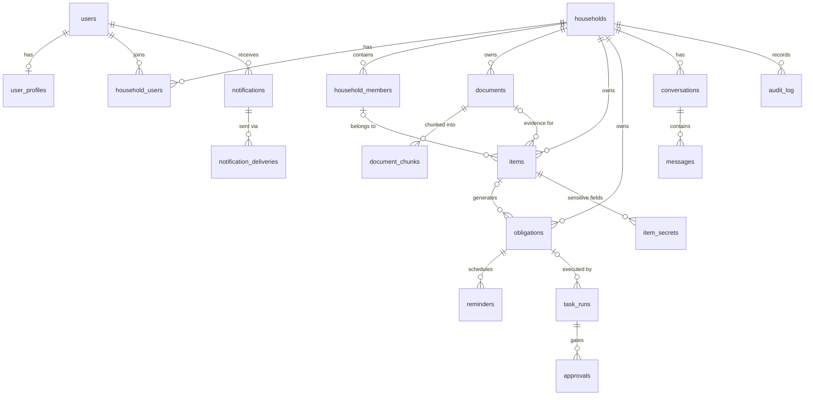

# 02 — Data Model

Postgres 16 (Supabase). Prisma manages the schema; RLS policies and triggers live in SQL migrations in the same package. Shown here as annotated DDL-style definitions — the Prisma schema is generated from this document during implementation, not the other way around.

Conventions: `id uuid primary key default gen_random_uuid()`; `created_at/updated_at timestamptz` on every table (trigger-maintained); soft-delete only where a doc-13 retention rule requires it — otherwise hard delete + audit record. All enums are Postgres enums (checked at the edge by Zod/Pydantic too).

## 1. Entity relationship overview



## 2. Identity & tenancy

```sql
-- Mirrors supabase auth.users; our app-side row (auth.users is not FK-able across schemas reliably)
users (
  id           uuid PK,              -- equals auth.users.id
  email        citext UNIQUE NOT NULL,
  status       user_status NOT NULL DEFAULT 'active',  -- active | suspended | deletion_pending
  created_at, updated_at
)

user_profiles (
  user_id      uuid PK FK->users,
  display_name text NOT NULL,
  locale       text NOT NULL DEFAULT 'en-US',
  timezone     text NOT NULL DEFAULT 'America/New_York',  -- drives reminder scheduling
  country      char(2) NOT NULL DEFAULT 'US',
  onboarding   jsonb NOT NULL DEFAULT '{}'
)

households (
  id           uuid PK,
  name         text NOT NULL,               -- "The Kuderski Household"
  created_by   uuid FK->users,
  email_alias  citext UNIQUE,               -- h-7f3k2@in.autobureau.com (doc 05 §2)
  created_at, updated_at
)

-- Which login accounts can access a household, and how (authz unit — doc 06 §4)
household_users (
  household_id uuid FK->households,
  user_id      uuid FK->users,
  role         household_role NOT NULL,     -- owner | member | viewer
  PRIMARY KEY (household_id, user_id)
)

-- The people/entities whose paperwork is managed (may have no login: children, dependents)
household_members (
  id            uuid PK,
  household_id  uuid FK->households NOT NULL,
  user_id       uuid FK->users NULL,        -- linked when the member has an account
  display_name  text NOT NULL,
  kind          member_kind NOT NULL,       -- adult | child | dependent | pet | entity
  date_of_birth date NULL,                  -- needed for age-triggered obligations (REAL ID, enrollment windows)
  created_at, updated_at
)
```

Design note: `household_users` (who may *access*) is deliberately separate from `household_members` (whose *stuff* it is). A caregiver persona is a `household_user:owner` of a household whose only other `household_member` is a parent with no account. Every domain table scopes to `household_id` — it is the tenancy key and the leading column of almost every index.

Signup creates a personal household automatically; "personal vs family" is not a mode, just membership count.

## 3. Documents

```sql
documents (
  id            uuid PK,
  household_id  uuid FK NOT NULL,
  uploaded_by   uuid FK->users NULL,        -- null for email-ingested
  source        doc_source NOT NULL,        -- upload | email | api
  storage_path  text NOT NULL,              -- Supabase Storage key, bucket 'documents'
  mime_type     text NOT NULL,
  size_bytes    bigint NOT NULL,
  sha256        bytea NOT NULL,             -- dedupe: UNIQUE (household_id, sha256)
  status        doc_status NOT NULL DEFAULT 'received',
                -- received | scanning | processing | needs_review | processed | rejected | failed
  doc_type      text NULL,                  -- classifier output: 'insurance_policy', 'receipt', ... (open vocab, doc 04 §5.1)
  confidence    numeric(4,3) NULL,
  title         text NULL,                  -- human-friendly, extracted
  doc_date      date NULL,                  -- the date ON the document
  extracted     jsonb NULL,                 -- full structured extraction, schema per doc_type
  review        jsonb NULL,                 -- reviewer corrections, kept for eval training data
  error         jsonb NULL,
  processed_at  timestamptz NULL,
  created_at, updated_at
)
-- INDEX (household_id, status), (household_id, doc_type, doc_date)

document_chunks (
  id           uuid PK,
  document_id  uuid FK->documents ON DELETE CASCADE,
  household_id uuid NOT NULL,               -- denormalized for RLS + filtered vector search
  seq          int NOT NULL,
  content      text NOT NULL,
  embedding    vector(1024) NULL,           -- Voyage; dimension pinned by ADR-006
  UNIQUE (document_id, seq)
)
-- NO vector index at launch (review A3/F-05): retrieval is exact KNN within one household —
-- btree (household_id) prefilter + ORDER BY embedding <=> $q. Exact recall, zero index
-- maintenance; avoids the filtered-HNSW post-filter recall pathology. ANN (per-partition
-- HNSW) is reconsidered only past ~50k chunks/household (doc 14).
```

`extracted` is schemaless jsonb *in the database* but strictly schema'd *in code*: every `doc_type` has a versioned Pydantic/Zod extraction schema in `packages/contracts` (doc 05 §4). We accept jsonb here because document taxonomies grow weekly; promoting a field to a column happens when a query needs it, via migration.

## 4. Registry: items & vendors

```sql
vendors (   -- global catalog, not household-scoped: 'GEICO', 'CA DMV', 'Netflix'
  id        uuid PK,
  name      text NOT NULL,
  kind      vendor_kind NOT NULL,           -- insurer | government | subscription | utility | retailer | other
  country   char(2) NOT NULL DEFAULT 'US',
  region    text NULL,                      -- state for DMV-likes
  domains   text[] NOT NULL DEFAULT '{}',   -- matching hints for email ingestion
  metadata  jsonb NOT NULL DEFAULT '{}'     -- renewal cadences, grace periods, cancellation URLs
)

items (
  id            uuid PK,
  household_id  uuid FK NOT NULL,
  member_id     uuid FK->household_members NULL,   -- whose passport/policy this is
  kind          item_kind NOT NULL,
      -- passport | drivers_license | vehicle_registration | vehicle | insurance_policy
      -- | subscription | warranty | membership | certification | lease | loan
      -- | utility_account | tax_year | benefit_plan | medical_account | other
  name          text NOT NULL,              -- "Honda CR-V registration", "Netflix"
  status        item_status NOT NULL DEFAULT 'active',  -- active | expiring | expired | cancelled | archived
  vendor_id     uuid FK->vendors NULL,
  vendor_name   text NULL,                  -- fallback when not in catalog
  attrs         jsonb NOT NULL DEFAULT '{}',-- typed per kind via versioned schema; NEVER identifier-grade PII (see item_secrets)
  amount_cents  bigint NULL,                -- recurring cost, for subscriptions/premiums
  currency      char(3) NULL,
  billing_cycle text NULL,                  -- rrule fragment: monthly | yearly | ...
  valid_from    date NULL,
  expires_at    date NULL,                  -- the single most important column in the product
  source_document_id uuid FK->documents NULL,
  created_at, updated_at
)
-- INDEX (household_id, kind), (household_id, expires_at) WHERE status IN ('active','expiring')

-- Identifier-grade PII quarantined out of items.attrs (doc 12 §5, ADR-007)
item_secrets (
  id          uuid PK,
  item_id     uuid FK->items ON DELETE CASCADE,
  field       text NOT NULL,                -- 'passport_number' | 'policy_number' | 'plate' | 'member_id' | ...
  ciphertext  bytea NOT NULL,               -- AES-256-GCM, envelope-encrypted (AWS KMS)
  key_version int NOT NULL,
  last4       text NULL,                    -- display hint, safe to show
  UNIQUE (item_id, field)
)
```

## 5. Obligations & reminders

```sql
obligations (
  id            uuid PK,
  household_id  uuid FK NOT NULL,
  item_id       uuid FK->items NULL,        -- null for free-standing ("file FBAR")
  member_id     uuid FK NULL,
  title         text NOT NULL,              -- "Renew Maya's passport"
  kind          obligation_kind NOT NULL,
      -- renewal | payment | cancellation_window | filing | claim | enrollment | appointment | custom
  due_at        timestamptz NOT NULL,
  window_start  timestamptz NULL,           -- earliest useful action time (passport: due-9mo)
  grace_until   timestamptz NULL,
  status        obligation_status NOT NULL DEFAULT 'upcoming',
      -- upcoming | action_needed | in_progress | waiting | done | dismissed | missed
  priority      smallint NOT NULL DEFAULT 2, -- 1=critical (legal/expiry), 2=important, 3=nice-to-do
  amount_cents  bigint NULL, currency char(3) NULL,
  recurrence    text NULL,                  -- RFC 5545 RRULE; completion of an occurrence spawns the next row
  source        obligation_source NOT NULL, -- ai | user | system  (system = rule-derived from item dates)
  source_document_id uuid FK NULL,
  ai_confidence numeric(4,3) NULL,
  resolution    jsonb NULL,                 -- how it ended: {done_via: 'task_run'|'manual', note}
  created_at, updated_at
)
-- INDEX (household_id, status, due_at); partial (due_at) WHERE status IN ('upcoming','action_needed')  -- radar scans

reminders (
  id            uuid PK,
  obligation_id uuid FK ON DELETE CASCADE,
  remind_at     timestamptz NOT NULL,
  offset_label  text NOT NULL,              -- 'T-90d' | 'T-30d' | 'T-7d' | 'T-1d' | 'overdue+3d'
  status        reminder_status NOT NULL DEFAULT 'scheduled',  -- scheduled | sent | skipped | cancelled
  UNIQUE (obligation_id, offset_label)
)
```

Reminder ladders are derived per obligation `kind` + `priority` (e.g. passport renewal: T-9mo, T-6mo, T-3mo, T-1mo, T-1w) and materialized as rows so the scheduler is a dumb indexed scan (doc 07 §5), and so snoozing is a row update, not policy logic.

## 6. Automation: task runs & approvals

```sql
task_runs (
  id             uuid PK,
  household_id   uuid FK NOT NULL,
  obligation_id  uuid FK NULL,
  workflow       text NOT NULL,             -- 'draft_cancellation' | 'prefill_form' | 'claim_letter' | ...
  status         task_status NOT NULL DEFAULT 'queued',
      -- queued | running | awaiting_approval | executing | succeeded | failed | cancelled | rejected
  requested_by   uuid FK->users NOT NULL,
  langgraph_thread_id text NULL,            -- checkpoint linkage (doc 04 §4)
  input          jsonb NOT NULL,
  output         jsonb NULL,                -- artifacts: drafted email, filled-form storage path
  error          jsonb NULL,
  cost_usd       numeric(10,6) NULL,
  started_at, finished_at timestamptz
)

approvals (
  id           uuid PK,
  task_run_id  uuid FK->task_runs NOT NULL,
  household_id uuid FK NOT NULL,
  kind         approval_kind NOT NULL,      -- send_email | apply_changes | create_calendar | share_artifact
  payload      jsonb NOT NULL,              -- EXACTLY what will happen, rendered verbatim to the user
  payload_sha256 bytea NOT NULL,            -- executor re-verifies hash: what was approved is what runs (doc 04 §6)
  status       approval_status NOT NULL DEFAULT 'pending',  -- pending | approved | rejected | expired
  requested_at timestamptz NOT NULL,
  decided_by   uuid FK->users NULL,
  decided_at   timestamptz NULL,
  expires_at   timestamptz NOT NULL         -- default requested_at + 7d; expiry cancels the run
)
```

## 7. Conversations

```sql
conversations (
  id uuid PK, household_id uuid FK NOT NULL, created_by uuid FK->users NOT NULL,
  title text NULL, last_message_at timestamptz, created_at, updated_at
)
messages (
  id uuid PK, conversation_id uuid FK ON DELETE CASCADE,
  role msg_role NOT NULL,                   -- user | assistant | tool
  content jsonb NOT NULL,                   -- block list: text, citations (document_id + chunk), tool summaries
  model text NULL, input_tokens int NULL, output_tokens int NULL,
  created_at
)
```

## 8. Notifications

```sql
notifications (
  id uuid PK, user_id uuid FK NOT NULL, household_id uuid FK NOT NULL,
  kind text NOT NULL,                       -- 'obligation.due_soon' | 'document.needs_review' | 'approval.requested' | 'digest.weekly' | ...
  title text NOT NULL, body text NOT NULL,
  data jsonb NOT NULL DEFAULT '{}',         -- deep-link payload
  read_at timestamptz NULL, created_at
)
notification_deliveries (
  id uuid PK, notification_id uuid FK ON DELETE CASCADE,
  channel notif_channel NOT NULL,           -- email | push | inapp
  status delivery_status NOT NULL DEFAULT 'queued',  -- queued | sent | delivered | bounced | failed | suppressed
  provider_message_id text NULL, sent_at timestamptz NULL, error text NULL
)
notification_preferences (
  user_id uuid FK NOT NULL, kind text NOT NULL, channel notif_channel NOT NULL,
  enabled boolean NOT NULL DEFAULT true,
  PRIMARY KEY (user_id, kind, channel)
)
-- plus users' quiet hours + digest day on user_profiles.onboarding → promoted to columns when stable
```

## 9. Platform: outbox, audit, ingestion

```sql
outbox_events (  -- doc 07 §2; the only bridge from transactions to async work
  id             bigserial PK,
  event_type     text NOT NULL,             -- 'document.uploaded' | 'obligation.created' | ... (taxonomy doc 07 §4)
  aggregate_type text NOT NULL, aggregate_id uuid NOT NULL,
  household_id   uuid NULL,
  payload        jsonb NOT NULL,            -- IDs + minimal facts; consumers re-read authoritative rows
  created_at     timestamptz NOT NULL DEFAULT now(),
  published_at   timestamptz NULL
)
-- INDEX (published_at) WHERE published_at IS NULL

audit_log (      -- append-only; INSERT-only grants; no UPDATE/DELETE for any app role
  id bigserial PK,
  household_id uuid NULL, actor_type actor_type NOT NULL,  -- user | agent | system
  actor_id uuid NULL,
  action text NOT NULL,                     -- 'obligation.dismissed', 'approval.approved', 'export.requested'
  target_type text NOT NULL, target_id uuid NULL,
  meta jsonb NOT NULL DEFAULT '{}',         -- diffs for sensitive mutations; PII-scrubbed (doc 10 §3)
  created_at timestamptz NOT NULL DEFAULT now()
)

inbound_emails ( -- doc 05 §2
  id uuid PK, alias citext NOT NULL, from_address text NOT NULL, subject text NULL,
  raw_storage_path text NOT NULL,           -- full MIME stored before any parsing
  status inbound_status NOT NULL DEFAULT 'received',  -- received | matched | quarantined | rejected
  household_id uuid FK NULL, document_ids uuid[] NOT NULL DEFAULT '{}',
  created_at
)
```

## 10. Cross-cutting decisions

- **Deletion semantics:** household deletion = hard-delete cascade across all household-scoped tables + Storage objects + chunk embeddings, with a `deletion_receipts` record (id, requested_at, completed_at, counts) retained per doc 13 §4. Backups age out within 35 days — that window is disclosed in the privacy policy rather than pretending backups can be surgically edited.
- **No cross-household references anywhere.** Enforced by RLS and by FK design (vendors are the only global table reachable from household data).
- **IDs are UUIDv7** (time-ordered) for insert locality on the big tables.
- **Migrations:** Prisma Migrate, forward-only, expand→migrate→contract for breaking changes; RLS/trigger SQL in the same migration stream (doc 09 §6).
- **Entitlements (review A8/F-08):** an `entitlements` table (household plan; caps: docs/mo, chat msgs/mo, Opus access) + monthly usage counters ship in the **launch** schema — free-tier caps are load-bearing for unit economics (doc 14 §4). The LLM-gateway budget check reads entitlements; cap-exceeded is a designed product state ("resumes on the 1st / upgrade"), not an error.
- **Volume estimates** driving index choices: at 100k households — documents ~30M rows/yr, chunks ~300M (the table that forces the doc-14 phase-2 decisions), obligations ~10M, everything else small.
